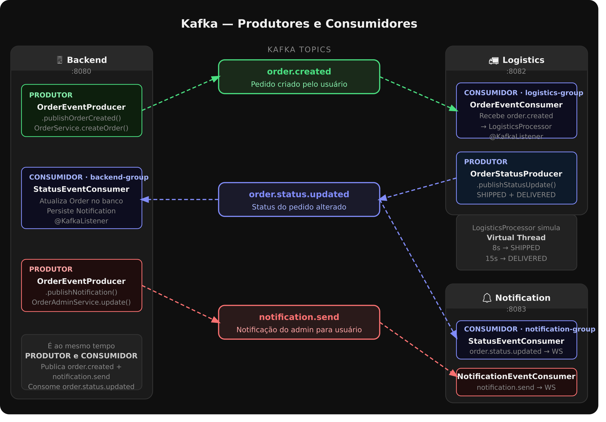

# 📚 TeeStore — Documentação Técnica

**Grupo:** Victor Hugo  
**Curso:** Análise e Desenvolvimento de Sistemas — 4º Período  
**Instituição:** PUC Goiás | **Semestre:** 2026/1

---

## 📁 Arquivos neste repositório

### N1 — Documentação inicial

| Arquivo | Descrição |
|---|---|
| `DocumentacaoTecnica_N1.pdf` | Documento unificado com toda a documentação da N1 (38 páginas) |
| `ArquiteturaBackend.pdf` | Detalhamento da arquitetura de microsserviços e decisões técnicas |
| `ArquiteturaC4.pdf` | Diagramas C4 — Contexto e Container (modelo arquitetural) |
| `PlanoDeQualidadeTeste.pdf` | Plano de testes, métricas de aceitação e requisitos não-funcionais |

### N2 — Documentação atualizada

| Arquivo | Descrição |
|---|---|
| `DocumentacaoTecnica_N2.pdf` | Documentação técnica completa do que foi entregue na N2 — arquitetura real implementada, pipeline Kafka, C4, design patterns, testes e interface |
| `PitchTecnico_N2.pdf` | Pitch técnico com 8 ADRs (Architecture Decision Records) defendendo cada escolha tecnológica e arquitetural do projeto |

### Diagramas

| Arquivo | Descrição |
|---|---|
| `Diagrama de contexto.png` | Diagrama C4 — Nível 1 (Contexto): atores externos e sistemas envolvidos |
| `Diagrama de conteiner.png` | Diagrama C4 — Nível 2 (Container): serviços, bancos de dados e comunicações |
| `kafka_producer_consumer.png` | Fluxo completo de produtores e consumidores Kafka entre os 3 serviços |

### Testes de API

| Arquivo | Descrição |
|---|---|
| `TeeStore_Demo.postman_collection.json` | Collection Postman com todas as rotas da API — importe no Postman para testar o backend localmente |

---

## 🔗 Repositórios do projeto

| Repositório | Descrição | Porta |
|---|---|---|
| [Projeto-Integrador-Infra](https://github.com/Projeto-Integrador-Modulo-5/Projeto-Integrador-Infra) | Docker Compose — orquestração de todos os serviços | — |
| [Projeto-Integrador-Backend](https://github.com/Projeto-Integrador-Modulo-5/Projeto-Integrador-Backend) | API REST principal (Spring Boot) | 8080 |
| [Projeto-Integrador-Logistics-Service](https://github.com/Projeto-Integrador-Modulo-5/Projeto-Integrador-Logistics-Service) | Serviço de simulação logística via Kafka | 8082 |
| [Projeto-Integrador-Notification-Service](https://github.com/Projeto-Integrador-Modulo-5/Projeto-Integrador-Notification-Service) | Notificações em tempo real via WebSocket/STOMP | 8083 |
| [Projeto-Integrador-Frontend](https://github.com/Projeto-Integrador-Modulo-5/Projeto-Integrador-Frontend) | SPA React + Vite | 5173 |
| [Projeto-Integrador-Documentacao](https://github.com/Projeto-Integrador-Modulo-5/Projeto-Integrador-Documentacao) | Este repositório — PDFs de documentação N1 e N2 | — |

---

## 📊 Diagramas C4

### Contexto


### Container


### Kafka — Produtores e Consumidores


---

## 🏗️ Arquitetura implementada (N2)

Plataforma de e-commerce de camisetas com 3 serviços Spring Boot, comunicação assíncrona via **Apache Kafka** e notificações em tempo real ao browser via **WebSocket/STOMP**.

```
┌─────────────────────────────────────────────────────────────────┐
│                        Frontend React :5173                     │
└────────────────────────────┬───────────────────────────────────┘
                             │ REST + JWT
                             ▼
┌─────────────────────────────────────────────────────────────────┐
│                     Backend :8080                               │
│  Auth · Produtos · Carrinho · Pedidos · Admin · Notificações    │
│  PostgreSQL · Redis (cart, JWT blacklist, refresh token)        │
└──────────────┬──────────────────────────┬───────────────────────┘
               │ Publica                  │ Consome
               │ order.created            │ order.status.updated
               ▼                          ▼
┌──────────────────────────────────────────────────────────────────┐
│                     Apache Kafka — 3 brokers                     │
│   Tópicos: order.created · order.status.updated · notification.send │
└──────┬────────────────────────────────────────┬─────────────────┘
       │ Consome order.created                  │ Consome order.status.updated
       ▼                                         │ Consome notification.send
┌──────────────────────┐                         ▼
│  Logistics :8082     │              ┌──────────────────────────┐
│  OrderEventConsumer  │              │   Notification :8083     │
│  LogisticsProcessor  │              │   StatusEventConsumer    │
│  (Virtual Thread)    │              │   NotificationEventConsumer│
│  8s → SHIPPED        │              │   WebSocket STOMP        │
│  15s → DELIVERED     │              └────────────┬─────────────┘
│  Publica             │                           │
│  order.status.updated│                           │ /topic/notifications/{userId}
└──────────────────────┘                           ▼
                                        Browser — toast em tempo real
```

**Stack:** Java 21 · Spring Boot 3.x · Apache Kafka (3 brokers) · PostgreSQL · Redis · React 18 + Vite · Docker Compose

---

## 🔄 Pipeline Kafka — Produtores e Consumidores

| Tópico | Produtor | Consumidor(es) |
|---|---|---|
| `order.created` | **Backend** — `OrderEventProducer.publishOrderCreated()` | **Logistics** — `OrderEventConsumer` (`logistics-group`) |
| `order.status.updated` | **Logistics** — `OrderStatusProducer.publishStatusUpdate()` | **Backend** — `StatusEventConsumer` (`backend-group`) · **Notification** — `StatusEventConsumer` (`notification-group`) |
| `notification.send` | **Backend** — `OrderEventProducer.publishNotification()` | **Notification** — `NotificationEventConsumer` (`notification-group`) |

O tópico `order.status.updated` é consumido por **dois consumer groups independentes** — o Backend atualiza o banco de dados e o Notification envia o WebSocket para o browser, sem acoplamento entre eles.

---

## ✅ Status das entregas

### N1
- [x] Diagramas C4 (Contexto + Container)
- [x] Plano de Testes e requisitos não-funcionais
- [x] Ambiente Docker configurado
- [x] Hello World end-to-end validado (Kafka + WebSocket)

### N2
- [x] Software funcional end-to-end (Backend + Logistics + Notification + Frontend)
- [x] Mensageria Kafka desacoplada — 3 tópicos, 3 consumer groups
- [x] Notificação em tempo real via WebSocket/STOMP
- [x] Design Patterns aplicados (DI, Strategy, Observer, Repository, Idempotência)
- [x] Clean Architecture — pacote `domain/` sem dependências do Spring
- [x] Testes unitários JUnit 5 + Mockito rodando nos 3 backends
- [x] CI/CD GitHub Actions com JaCoCo em todos os repositórios
- [x] Interface React fiel ao protótipo (painel admin + loja + notificações)
- [x] Documentação N2 e Pitch Técnico produzidos

---

*Projeto Integrador — Desenvolvido por Victor Hugo, Josue Felix e Guilherme Bastos*
